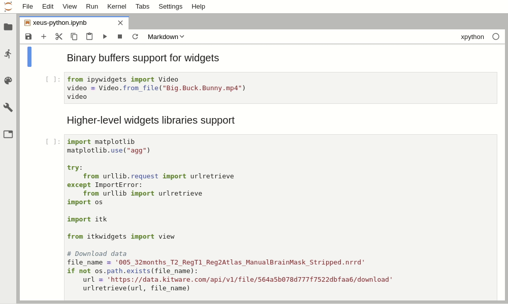

# 

[](https://travis-ci.org/QuantStack/xeus-python)
[](https://ci.appveyor.com/project/QuantStack/xeus-python)
[](https://xeus-python.readthedocs.io/en/latest/?badge=latest)
[](https://mybinder.org/v2/gh/QuantStack/xeus-python/stable?filepath=notebooks/xeus-python.ipynb)
[](https://gitter.im/QuantStack/Lobby?utm_source=badge&utm_medium=badge&utm_campaign=pr-badge&utm_content=badge)

`xeus-python` is a Jupyter kernel for Python based on the native implementation of the Jupyter protocol [xeus](https://github.com/QuantStack/xeus).


## Usage

Launch the Jupyter notebook with `jupyter notebook` or Jupyter lab with `jupyter lab` and launch a new Python notebook by selecting the **xpython** kernel.

**Code execution and variable display**:


**Output streams**:


**Input streams**:


**Error handling**:


**Inspect**:


**Code completion**:


**Rich display**:


**And of course widgets**:





## Installation

xeus-python has been packaged for the conda package manager.

To ensure that the installation works, it is preferable to install `xeus-python` in a fresh conda environment. It is also needed to use a [miniconda](https://conda.io/miniconda.html) installation because with the full [anaconda](https://www.anaconda.com/) you may have a conflict with the `zeromq` library which is already installed in the anaconda distribution.


The safest usage is to create an environment named `xeus-python` with your miniconda installation

```bash
conda create -n xeus-python
source activate xeus-python
```

### Installation directly from conda

Then you can install in this environment `xeus-python` and its dependencies

```bash
conda install xeus-python notebook -c QuantStack -c conda-forge
```

### Installation from source

Or you can install it from the sources, you will first need to install dependencies

```bash
conda install cmake xeus nlohmann_json cppzmq xtl pybind11 jedi pygments six notebook -c QuantStack -c conda-forge
```

Then you can compile the sources

```bash
cmake -D CMAKE_INSTALL_PREFIX=your_conda_path -D PYTHON_EXECUTABLE=`which python`
make && make install
```

## Trying it online

To try out xeus-python interactively in your web browser, just click on the binder
link:

[](https://mybinder.org/v2/gh/QuantStack/xeus-python/stable?filepath=notebooks/xeus-python.ipynb)

## Documentation

To get started with using `xeus-python`, check out the full documentation

http://xeus-python.readthedocs.io/

## Dependencies

``xeus-python`` depends on

 - [xeus](https://github.com/QuantStack/xeus)
 - [xtl](https://github.com/QuantStack/xtl)
 - [pybind11](https://github.com/pybind/pybind11)
 - [nlohmann_json](https://github.com/nlohmann/json)


| `xeus-python`|   `xeus`        |      `xtl`      | `cppzmq` | `nlohmann_json` | `pybind11`      | `jedi`            | `pygments`        | `six`             |
|--------------|-----------------|-----------------|----------|-----------------|-----------------|-------------------|-------------------|-------------------|
|  master      |  >=0.18.1,<0.19 |  >=0.5.2,<0.6   | ~4.3.0   | >=3.3.0,<4.0    | >=2.2.4,<3.0    | >=0.13.1,<0.14.0  | >=2.3.1,<3.0.0    | >=1.12.0,<2.0.0   |
|  0.1.2       |  >=0.18.1,<0.19 |  >=0.5.2,<0.6   | ~4.3.0   | >=3.3.0,<4.0    | >=2.2.4,<3.0    | >=0.13.1,<0.14.0  | >=2.3.1,<3.0.0    | >=1.12.0,<2.0.0   |
|  0.1.1       |  >=0.18.1,<0.19 |  >=0.5.2,<0.6   | ~4.3.0   | >=3.3.0,<4.0    | >=2.2.4,<3.0    | >=0.13.1,<0.14.0  | >=2.3.1,<3.0.0    |                   |
|  0.1.0       |  >=0.18.1,<0.19 |  >=0.5.2,<0.6   | ~4.3.0   | >=3.3.0,<4.0    | >=2.2.4,<3.0    | >=0.13.1,<0.14.0  | >=2.3.1,<3.0.0    |                   |
|  0.0.4       |  >=0.18.1,<0.19 |  >=0.5.2,<0.6   | ~4.3.0   | >=3.3.0,<4.0    | >=2.2.4,<3.0    | >=0.13.1,<0.14.0  |                   |                   |
|  0.0.3       |  >=0.17.0,<0.18 |  >=0.5.0,<0.6   | ~4.3.0   | >=3.3.0,<4.0    | >=2.2.4,<3.0    | >=0.13.1,<0.14.0  |                   |                   |
|  0.0.2       |  >=0.16.0,<0.17 |  >=0.4.0,<0.5   | ~4.3.0   | >=3.3.0,<4.0    | >=2.2.4,<3.0    |                   |                   |                   |
|  0.0.1       |  >=0.15.0,<0.16 |  >=0.4.0,<0.5   | ~4.3.0   | >=3.3.0,<4.0    | >=2.2.4,<3.0    |                   |                   |                   |


The `QuantStack` channel provides `xeus` dependencies built with gcc-7. We highly recommend installing
these dependencies from QuantStack in a clean conda installation or environment.

## License

We use a shared copyright model that enables all contributors to maintain the
copyright on their contributions.

This software is licensed under the BSD-3-Clause license. See the [LICENSE](LICENSE) file for details.
