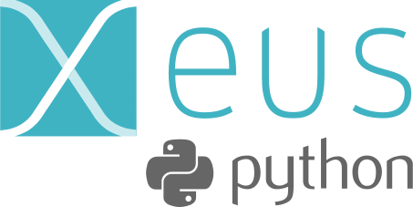

# 

[](https://travis-ci.org/QuantStack/xeus-python)
[](https://ci.appveyor.com/project/QuantStack/xeus-python)
[](https://xeus-python.readthedocs.io/en/latest/?badge=latest)
[](https://mybinder.org/v2/gh/QuantStack/xeus-python/stable?filepath=notebooks/xeus-python.ipynb)
[](https://gitter.im/QuantStack/Lobby?utm_source=badge&utm_medium=badge&utm_campaign=pr-badge&utm_content=badge)

`xeus-python` is a Jupyter kernel for Python based on the native implementation of the Jupyter protocol [xeus](https://github.com/QuantStack/xeus).

**xeus-python is an early developer preview, and is not suitable for general usage yet. Features and implementation are subject to change.**

## Installation

xeus-python has been packaged for the conda package manager.

To ensure that the installation works, it is preferable to install `xeus-python` in a fresh conda environment. It is also needed to use a [miniconda](https://conda.io/miniconda.html) installation because with the full [anaconda](https://www.anaconda.com/) you may have a conflict with the `zeromq` library which is already installed in the anaconda distribution.


The safest usage is to create an environment named `xeus` with your miniconda installation

```
conda create -n xeus
source activate xeus
```

Then you can install in this environment `xeus-python` and its dependencies

```
conda install xeus-python notebook -c QuantStack -c conda-forge
```

Or you can install it directly from the sources, if all the dependencies are already installed.

```bash
cmake -DCMAKE_INSTALL_PREFIX=your_conda_path -DCMAKE_INSTALL_LIBDIR=your_conda_path/lib
make && make install
```

## Trying it online

To try out xeus-python interactively in your web browser, just click on the binder
link:

[](https://mybinder.org/v2/gh/QuantStack/xeus-python/stable?filepath=notebooks/xeus-python.ipynb)

## Documentation

To get started with using `xeus-python`, check out the full documentation

http://xeus-python.readthedocs.io/

## Usage

Launch the jupyter notebook with `jupyter notebook` and launch a new C++ notebook by selecting the **xeus-python** kernel in the *new* dropdown.

## Dependencies

``xeus-python`` depends on

 - [xeus](https://github.com/QuantStack/xeus)
 - [xtl](https://github.com/QuantStack/xtl)
 - [Python C API](https://github.com/root-project/cling)
 - [pugixml](https://github.com/zeux/pugixml)
 - [cxxopts](https://github.com/jarro2783/cxxopts)
 - [nlohmann_json](https://github.com/nlohmann/json)


| `xeus-python`|   `xeus`        |      `xtl`      |   `pugixml`   | `cppzmq` | `cxxopts`     | `nlohmann_json` | `dirent` (windows only) |
|--------------|-----------------|-----------------|---------------|----------|---------------|-----------------|-------------------------|
|  master      |  >=0.14.1,<0.15 |  >=0.4.0,<0.5   | ~1.8.1        | ~4.3.0   | >=2.1.1,<=3.0 | >=3.1.2,<4.0    | >=2.3.2,<3              |


The `QuantStack` channel provides `xeus` dependencies built with gcc-7. We highly recommend installing
these dependencies from QuantStack in a clean conda installation or environment.

## License

We use a shared copyright model that enables all contributors to maintain the
copyright on their contributions.

This software is licensed under the BSD-3-Clause license. See the [LICENSE](LICENSE) file for details.
